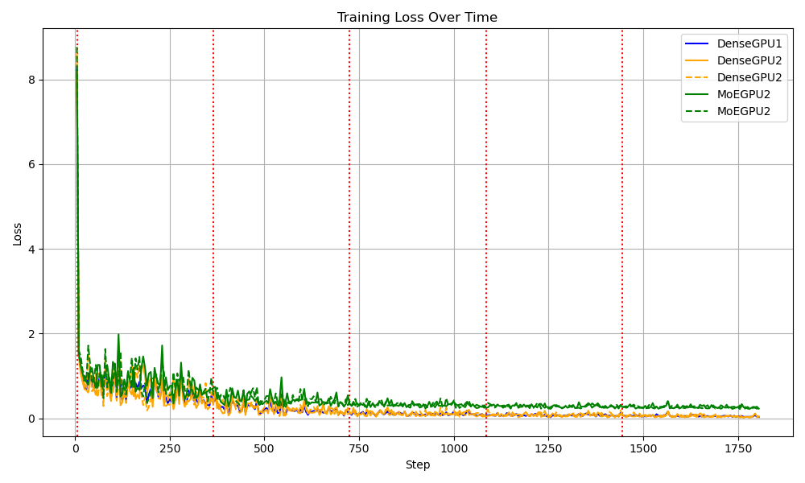
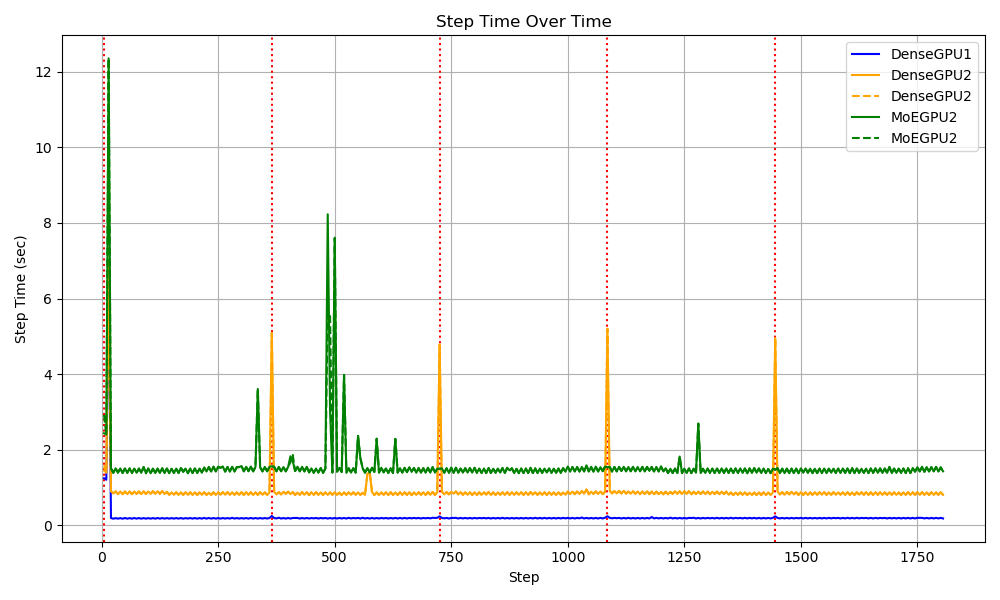
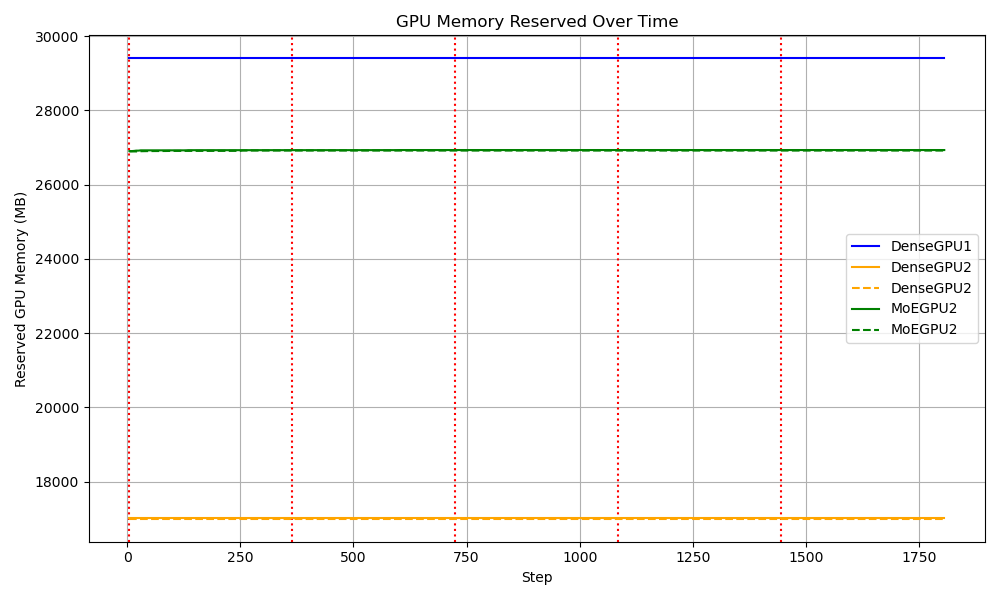
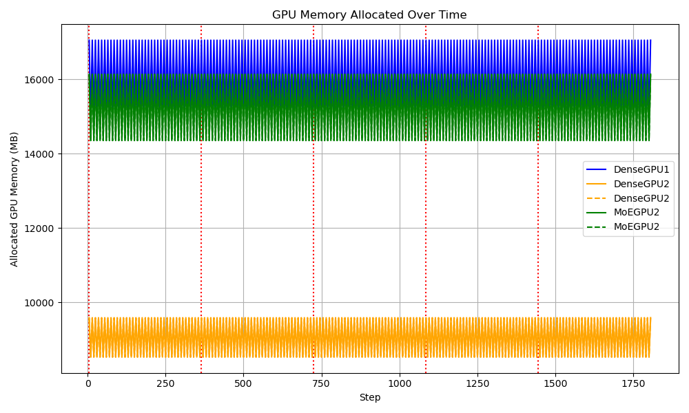
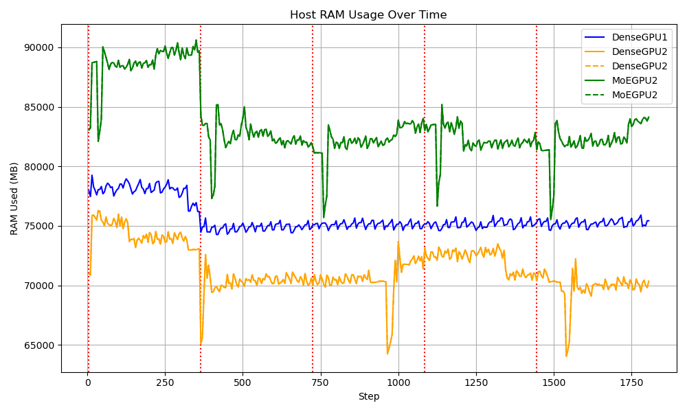

# COMS6998-gp-MoE
This is the groupwork of the course COMS6998 High-Performance Machine Learning in Columbia University, Spring 2025. The group Menbers are Tom, Layton and Andy.

## Setup (Windows)
1. Install conda
2. Create conda env: `conda create --name <env> --file req.txt`(Simple Version: use set_up.sh. May need to use chmod +x)
4. Download `https://huggingface.co/datasets/cognitivecomputations/dolphin/blob/main/flan1m-alpaca-uncensored-deduped.jsonl` and save to `./dataset`
5. Run `1.data_preprocessing.py`
6. Run one of the following commands.

## Commands
- Run baseline (using `TinyLlama/TinyLlama-1.1B-Chat-v1.0`):
``
python project.py --experiment_type dense --model_name_or_path "TinyLlama/TinyLlama-1.1B-Chat-v1.0" --data_path 
"dataset\flan1m_2.5percent" --output_dir "outputs\dense_baseline" --use_lora False 
--per_device_train_batch_size 1 --gradient_accumulation_steps 1 --learning_rate 2e-5 
--num_train_epochs 1 --logging_steps 10 --save_strategy epoch --bf16 False --fp16 True --do_train True --model_max_length 512 --gradient_checkpointing True
``

- Run MoE + Router Random (using `TinyLlama/TinyLlama-1.1B-Chat-v1.0`):
``
 python project.py --experiment_type moe --router_strategy random --model_name_or_path "TinyLlama/TinyLlama-1.1B-Chat-v1.0" --data_path "dataset/flan1m_2.5percent" --output_dir "outputs/moe_router_random" --use_lora False --per_device_train_batch_size 1 --gradient_accumulation_steps 8 --learning_rate 2e-5 --num_train_epochs 1 --logging_steps 10 --save_strategy epoch --bf16 False --fp16 True --do_train True --model_max_length 512 --gradient_checkpointing True
``

- Run baseline, with wandb:
``
python <name_of_program> --experiment_type dense --model_name_or_path "TinyLlama/TinyLlama-1.1B-Chat-v1.0" --data_path 
"dataset\flan1m_2.5percent" --output_dir "outputs\dense_baseline" --use_lora False 
--per_device_train_batch_size 1 --gradient_accumulation_steps 1 --learning_rate 2e-5 
--num_train_epochs 1 --logging_steps 10 --save_strategy epoch --bf16 False --fp16 True --do_train True --model_max_length 512 --gradient_checkpointing True
--wandb_project <name_of_project> --run_name <name_of_run> --wandb_entity <name of team>
``

-Run project_single.py on A100:
dense:
``
deepspeed project_single.py \
  --run_mode train \
  --output_dir /root/V429/output \
  --per_device_train_batch_size 8 \
  --gradient_accumulation_steps 2 \
  --model_max_length 1024 \
  --logging_steps 10 \
  --save_interval 1000 \
  --bf16 \
  --deepspeed /root/V429/ds_config.json
``
MoE:
``
deepspeed project_single.py \
  --run_mode train \
  --output_dir /root/V429/output \
  --experiment_type moe \
  --per_device_train_batch_size 8 \
  --gradient_accumulation_steps 2 \
  --model_max_length 1024 \
  --logging_steps 10 \
  --save_interval 1000 \
  --bf16 \
  --deepspeed /root/V429/ds_config.json
``
- Run project_run.py on A100:
Dense:
``
deepspeed /root/V429/project_run.py \
  --run_mode train \
  --output_dir /root/autodl-tmp/V429/output \
  --per_device_train_batch_size 8 \
  --gradient_accumulation_steps 2 \
  --model_max_length 1024 \
  --logging_steps 10 \
  --save_interval 400 \
  --bf16 \
  --use_wandb \
  --wandb_project llama-training-20250429 \
  --wandb_entity 6998gp_TLA \
  --deepspeed /root/V429/ds_config.json
``

MoE Random:
``
deepspeed /root/V429/project_run.py \
  --run_mode train \
  --output_dir /root/autodl-tmp/V429/output \
  --per_device_train_batch_size 8 \
  --gradient_accumulation_steps 2 \
  --model_max_length 1024 \
  --logging_steps 10 \
  --save_interval 400 \
  --bf16 \
  --use_wandb \
  --wandb_project llama-training-20250429 \
  --wandb_entity 6998gp_TLA \
  --deepspeed /root/V429/ds_config.json \
  --experiment_type moe \
  --router_strategy random
``

MoE mixtral:
``
deepspeed /root/V429/project_run.py \
  --run_mode train \
  --output_dir /root/autodl-tmp/V429/output \
  --per_device_train_batch_size 8 \
  --gradient_accumulation_steps 2 \
  --model_max_length 1024 \
  --logging_steps 10 \
  --save_interval 400 \
  --bf16 \
  --use_wandb \
  --wandb_project llama-training-20250429 \
  --wandb_entity 6998gp_TLA \
  --deepspeed /root/V429/ds_config.json \
  --experiment_type moe \
  --router_strategy mixtral
``

Eval:
1. Raw model + AskNews-input
2. Baseline model (AskNews-input-output) + AskNews-input
3. MOE model (AskNews-input-output MOE)
[4]. LoRA model (Raw model + AskNews-input-output) + AskNews-input
[5]. Llama3.2 1b model + AskNews-input

1. (0) Fix project.py to train on TinyLlama 1b (Tom)
2. (0) Zero3 + 2 GPU configuration (test on andrijdavid/Llama3-1B-Base) (Layton + Jingtian)
2.2. (2) Double check WanDB Metrics
3. (1,2,2.2) Train on TinyLlama 1b + AskNews (Baseline)
4. (3) Eval Baseline model (AskNews-input-output) + AskNews-input
5. (3) Train on TinyLlama 1b + AskNews (MOE model)
6. (5) Eval MOE model (AskNews-input-output MOE)
[7]. (1) LoRA model (Raw model + AskNews-input-output) + AskNews-input
[8]. (0) Eval Llama3.2 1b model + AskNews-input (Tom)

Thanks for the clarification! Here's the revised **Results & Evaluation** section for your README, making it explicit that **all charts compare the three models: Dense (1 GPU), Dense (2 GPUs), and MoE (2 GPUs)**.

---

## Results & Evaluation

We trained and evaluated three variants of TinyLlama-1.1B on the **AskNews-NER-v0** dataset to compare dense and sparse (MoE) fine-tuning strategies under compute constraints. Each model was assessed on quality, training efficiency, and resource usage.

### Overall Performance Metrics

| Model                     | BLEU              | ROUGE-L           | METEOR            | Cosine Sim.      | NER Overlap       |
| ------------------------- | ----------------- | ----------------- | ----------------- | ---------------- | ----------------- |
| Dense (1 GPU)             | **0.256** (+848%) | **0.448** (+113%) | 0.382 (+101%)     | **0.556** (+39%) | **0.292** (+630%) |
| Dense (2 GPUs)            | 0.252 (+833%)     | 0.436 (+108%)     | **0.383** (+102%) | 0.551 (+37%)     | 0.291 (+628%)     |
| MoE (2 GPUs)              | 0.221 (+718%)     | 0.407 (+94%)      | 0.345 (+82%)      | 0.498 (+24%)     | 0.263 (+558%)     |
| TinyLlama-1.1B (original) | 0.027             | 0.210             | 0.190             | 0.401            | 0.040             |

> Source: `eval/summary_metrics.csv`

**Key Takeaways:**

* Dense models consistently outperform MoE across all metrics.
* All fine-tuned models substantially improve over the original TinyLlama base.
* MoE performs reasonably but lags behind in both quality and efficiency.

### Training Dynamics and Resource Usage (All 3 Models)

The plots below show **side-by-side comparisons of all three models** throughout training:

**Dense (1 GPU)**
**Dense (2 GPUs with ZeRO-2)**
**MoE (2 GPUs with top-1 routing)**

| Metric                  | Plot                                                    |
| ----------------------- | ------------------------------------------------------- |
| Training Loss Over Time |       |
| Step Time Over Time     |               |
| GPU Memory Reserved     |  |
| GPU Memory Used         |          |
| Host RAM Usage          |               |

**Observations:**

* **Step Time:** Dense (1 GPU) is fastest (\~0.4s), while MoE is slowest (\~1.6s) due to routing overhead.
* **GPU Efficiency:** Dense (2 GPU) with ZeRO-2 uses the least GPU memory (\~10 GB) despite running across two devices.
* **MoE Overhead:** MoE uses more GPU memory (\~16.5 GB) and RAM (\~90 GB) due to expert routing and duplication.

### Profiler Insights

Using PyTorch Profiler + DeepSpeed tracing:

* **MoE vs. Dense:** MoE adds \~6.9s per profiling window from routing and tensor operations like `index_put`, `nonzero`, and extra `mm` ops.
* **Dense (2 GPUs):** ZeRO-2 improves memory use but introduces communication latency (\~8.5ms/step from `allreduce` and `record_param_comms`).

## WanDB Link
https://wandb.ai/6998gp_TLA/projects